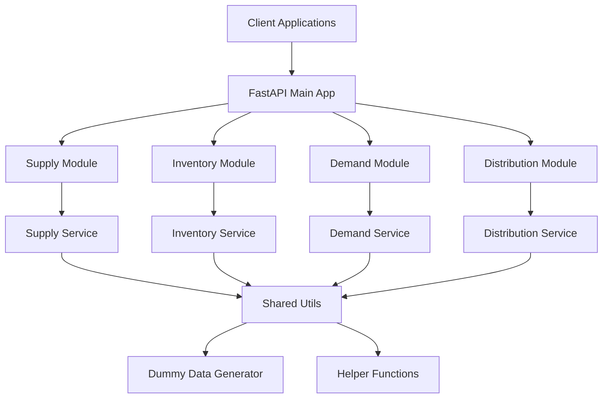
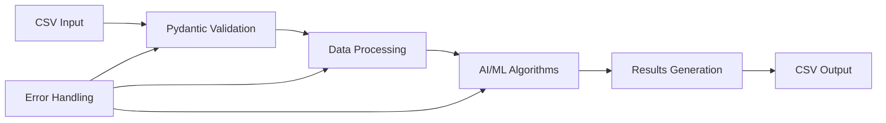
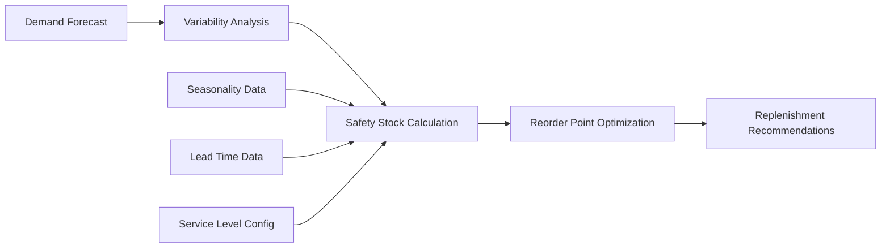
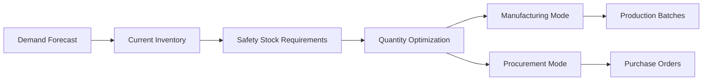
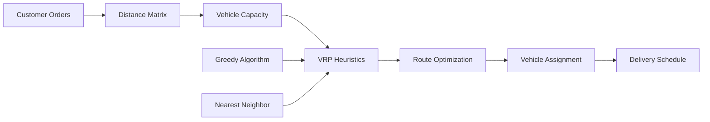

# Design Document

## Overview

The Balancer platform is designed as an AI-powered modular FastAPI application that provides intelligent supply chain optimization capabilities through four independent but interconnected domains. The architecture follows Domain-Driven Design (DDD) principles with clear separation between API layers, machine learning services, and data models. Each domain (supply, inventory, demand, distribution) operates as a self-contained module with its own API endpoints, AI-powered business logic, and specialized optimization algorithms.

The platform uses FastAPI for high-performance async API handling, Pydantic for robust data validation, LightGBM for machine learning forecasting, and advanced optimization algorithms for supply chain intelligence. The design emphasizes modularity, AI-driven decision making, and scalability while providing a clean developer experience with built-in machine learning capabilities.

## Architecture

### High-Level Architecture



### Project Structure

```
balancer/
├── main.py                 # FastAPI app entry point
├── config.py              # Configuration management
├── requirements.txt       # Dependencies
├── README.md              # Documentation
├── supply/                # Supply management module
│   ├── __init__.py
│   ├── api.py            # FastAPI routes
│   ├── models.py         # Pydantic schemas
│   ├── service.py        # Business logic
│   └── example.py        # Usage examples
├── inventory/             # Inventory management module
│   ├── __init__.py
│   ├── api.py
│   ├── models.py
│   ├── service.py
│   └── example.py
├── demand/                # Demand forecasting module
│   ├── __init__.py
│   ├── api.py
│   ├── models.py
│   ├── service.py
│   └── example.py
├── distribution/          # Distribution planning module
│   ├── __init__.py
│   ├── api.py
│   ├── models.py
│   ├── service.py
│   └── example.py
├── utils/                 # Shared utilities
│   ├── __init__.py
│   ├── dummy_data.py     # Mock data generation with time-series support
│   ├── helpers.py        # Common helper functions
│   └── ml_utils.py       # Machine learning utilities and feature engineering
└── tests/                 # Test suite
    ├── __init__.py
    ├── test_supply.py
    ├── test_inventory.py
    ├── test_demand.py
    ├── test_distribution.py
    └── conftest.py       # Pytest configuration
```

## CSV Processing Workflow

The platform is designed around a CSV-in, CSV-out workflow for each domain module:

### Data Processing Pipeline



### Input/Output Specifications

#### Demand Forecasting Module
- **Input**: `demand_data.csv` with columns: `date`, `sku`, `quantity`
- **Output**: `forecast_output.csv` with columns: `sku`, `forecast_date`, `prediction`
- **Processing**: LightGBM time-series forecasting with feature engineering

#### Inventory Management Module
- **Input**: `inventory_status.csv` with columns: `sku`, `current_stock`, `lead_time_days`, `service_level_target`, `avg_weekly_demand`, `demand_std_dev`
- **Output**: `inventory_recommendations.csv` with columns: `sku`, `safety_stock`, `reorder_point`, `current_stock`, `recommended_action`, `days_until_stockout`
- **Processing**: Safety stock calculation and reorder point optimization

#### Supply Management Module (Procurement Mode)
- **Input**: `procurement_data.csv` with columns: `sku`, `current_inventory`, `forecast_demand_4weeks`, `safety_stock`, `min_order_qty`, `supplier_id`, `unit_cost`
- **Output**: `procurement_recommendations.csv` with columns: `sku`, `recommended_quantity`, `supplier_id`, `order_date`, `expected_delivery`, `total_cost`
- **Processing**: Quantity optimization considering constraints and costs

#### Supply Management Module (Manufacturing Mode)
- **Input**: `manufacturing_data.csv` with columns: `sku`, `current_inventory`, `forecast_demand_4weeks`, `safety_stock`, `batch_size`, `production_time_days`, `unit_cost`
- **Output**: `manufacturing_recommendations.csv` with columns: `sku`, `recommended_batch_qty`, `production_start_date`, `production_complete_date`, `total_cost`
- **Processing**: Production batch optimization and scheduling

#### Distribution Module
- **Input**: `orders_and_vehicles.csv` with order and vehicle data
  - Orders: `order_id`, `customer_lat`, `customer_lon`, `volume_m3`, `weight_kg`
  - Vehicles: `vehicle_id`, `max_volume_m3`, `max_weight_kg`, `cost_per_km`
- **Output**: `route_assignments.csv` with columns: `vehicle_id`, `order_id`, `sequence`, `distance_km`, `total_cost`
- **Processing**: VRP optimization with capacity constraints

## Components and Interfaces

### Main Application (main.py)

The main application serves as the entry point and orchestrates all modules:

- Initializes FastAPI app with metadata and configuration
- Includes routers from all four domain modules
- Sets up CORS, middleware, and global exception handling
- Provides health check and system status endpoints

### Configuration Management (config.py)

Centralized configuration using Pydantic Settings with AI model parameters:

- Environment variable loading with defaults
- Machine learning model configuration (LightGBM parameters, training settings)
- AI-specific parameters (forecast frequency, service levels, lead times, transport capacity)
- Database connection settings (for future expansion)
- API configuration (CORS, rate limiting, etc.)
- Module-specific optimization settings
- Validation of required configuration values including ML parameters

### Domain Modules

Each domain module follows a consistent three-layer architecture:

#### API Layer (api.py)
- FastAPI router with RESTful endpoints
- Request/response handling using Pydantic models
- HTTP status code management
- Error handling and validation
- OpenAPI documentation tags

#### Models Layer (models.py)
- Pydantic BaseModel schemas for data validation
- Request/response models for API endpoints
- Internal data models for business logic
- Field validation rules and constraints
- Model relationships and dependencies

#### Service Layer (service.py)
- AI-powered business logic implementation with machine learning models
- Advanced data processing, feature engineering, and optimization algorithms
- Integration with external services (mocked) and ML model training/inference
- Error handling, business rule validation, and model performance monitoring
- Async/await support for scalability and ML pipeline execution

### Shared Utilities (utils/)

#### Dummy Data Generator (dummy_data.py)
- Factory functions for generating test data
- Realistic sample data for each domain
- Configurable data generation parameters
- Support for different data scenarios
- Integration with pytest fixtures

#### Helper Functions (helpers.py)
- Common utility functions used across modules
- Data transformation utilities and feature engineering functions
- Validation helpers and ML data preprocessing
- Date/time manipulation functions for time-series analysis
- Mathematical calculations for optimization and statistical analysis

#### Machine Learning Utilities (ml_utils.py)
- Feature engineering functions for demand forecasting
- Model training and evaluation utilities
- Time-series preprocessing and validation
- Performance metrics calculation and model monitoring
- Common ML pipeline components and data transformations

## Data Models

### Supply Domain Models

```python
# Procurement Mode - Input Models
class ProcurementDataInput(BaseModel):
    sku: str
    current_inventory: int
    forecast_demand_4weeks: int
    safety_stock: int
    min_order_qty: int
    supplier_id: str
    unit_cost: float

class ProcurementDataCSV(BaseModel):
    data: List[ProcurementDataInput]

# Manufacturing Mode - Input Models
class ManufacturingDataInput(BaseModel):
    sku: str
    current_inventory: int
    forecast_demand_4weeks: int
    safety_stock: int
    batch_size: int
    production_time_days: int
    unit_cost: float

class ManufacturingDataCSV(BaseModel):
    data: List[ManufacturingDataInput]

# Procurement Output Models
class ProcurementRecommendation(BaseModel):
    sku: str
    recommended_quantity: int
    supplier_id: str
    order_date: str  # YYYY-MM-DD format
    expected_delivery: str  # YYYY-MM-DD format
    total_cost: float

class ProcurementRecommendationsCSV(BaseModel):
    recommendations: List[ProcurementRecommendation]

# Manufacturing Output Models
class ManufacturingRecommendation(BaseModel):
    sku: str
    recommended_batch_qty: int
    production_start_date: str  # YYYY-MM-DD format
    production_complete_date: str  # YYYY-MM-DD format
    total_cost: float

class ManufacturingRecommendationsCSV(BaseModel):
    recommendations: List[ManufacturingRecommendation]
```

### Inventory Domain Models

```python
# Input Models (CSV Processing)
class InventoryStatusInput(BaseModel):
    sku: str
    current_stock: int
    lead_time_days: int
    service_level_target: float  # 0.95 for 95%
    avg_weekly_demand: float
    demand_std_dev: float

class InventoryStatusCSV(BaseModel):
    data: List[InventoryStatusInput]

# Output Models
class InventoryRecommendation(BaseModel):
    sku: str
    safety_stock: int
    reorder_point: int
    current_stock: int
    recommended_action: str  # "REORDER", "URGENT_REORDER", "SUFFICIENT_STOCK"
    days_until_stockout: Optional[int]

class InventoryRecommendationsCSV(BaseModel):
    recommendations: List[InventoryRecommendation]

# Internal Processing Models
class SafetyStockCalculation(BaseModel):
    sku: str
    demand_variability: float
    lead_time_days: int
    service_level: float
    z_score: float
    calculated_safety_stock: int
    reorder_point: int
```

### Demand Domain Models

```python
# Input Models (CSV Processing)
class DemandDataInput(BaseModel):
    date: str  # YYYY-MM-DD format
    sku: str
    quantity: int

class DemandDataCSV(BaseModel):
    data: List[DemandDataInput]

# Output Models
class ForecastOutput(BaseModel):
    sku: str
    forecast_date: str  # YYYY-MM-DD format
    prediction: float

class ForecastOutputCSV(BaseModel):
    forecasts: List[ForecastOutput]

# Internal Processing Models
class DemandRecord(BaseModel):
    sku: str
    date: datetime
    quantity: int
    processed_features: Optional[Dict[str, float]]

class ForecastModel(BaseModel):
    sku: str
    model_version: str
    training_data_points: int
    feature_importance: Dict[str, float]
    accuracy_metrics: Dict[str, float]
```

### Distribution Domain Models

```python
# Input Models (CSV Processing)
class OrderInput(BaseModel):
    order_id: str
    customer_lat: float
    customer_lon: float
    volume_m3: float
    weight_kg: float

class VehicleInput(BaseModel):
    vehicle_id: str
    max_volume_m3: float
    max_weight_kg: float
    cost_per_km: float

class OrdersAndVehiclesCSV(BaseModel):
    orders: List[OrderInput]
    vehicles: List[VehicleInput]

# Output Models
class RouteAssignment(BaseModel):
    vehicle_id: str
    order_id: str
    sequence: int  # Order of delivery in the route
    distance_km: float
    total_cost: float

class RouteAssignmentsCSV(BaseModel):
    assignments: List[RouteAssignment]

# Internal Processing Models
class VRPSolution(BaseModel):
    total_distance: float
    total_cost: float
    vehicle_utilization: Dict[str, float]  # vehicle_id -> utilization percentage
    algorithm_used: str  # "greedy" or "nearest_neighbor"
    optimization_time_seconds: float

class DistanceMatrix(BaseModel):
    distances: Dict[str, Dict[str, float]]  # order_id -> order_id -> distance_km
    calculation_method: str  # "euclidean" or "haversine"
```

## Error Handling

### Global Exception Handling

- Custom exception classes for each domain
- HTTP exception mapping with appropriate status codes
- Structured error responses with consistent format
- Logging integration for debugging and monitoring
- Validation error handling with detailed field-level messages

### Error Response Format

```python
class ErrorResponse(BaseModel):
    error: str
    message: str
    details: Optional[Dict[str, Any]]
    timestamp: datetime
    request_id: str
```

### Domain-Specific Exceptions

- `SupplyChainException`: Base exception for all domains
- `SupplierNotFoundException`: Supply domain specific
- `InsufficientInventoryException`: Inventory domain specific
- `InvalidForecastException`: Demand domain specific
- `RouteOptimizationException`: Distribution domain specific

## Testing Strategy

### Test Organization

- Separate test files for each domain module
- Integration tests for API endpoints
- Unit tests for service layer logic
- Fixture-based test data management
- Mock external dependencies

### Test Categories

#### API Tests
- Endpoint response validation
- HTTP status code verification
- Request/response schema validation
- Error handling scenarios
- Authentication and authorization (future)

#### Service Tests
- Business logic validation
- Data transformation accuracy
- Error condition handling
- Performance benchmarking
- Mock dependency integration

#### Integration Tests
- Cross-module functionality
- End-to-end workflow testing
- Data consistency validation
- System health checks

### Test Data Management

- Pytest fixtures for consistent test data
- Factory pattern for generating test objects
- Database state management (for future database integration)
- Test isolation and cleanup
- Performance test data sets

### Coverage Requirements

- Minimum 90% code coverage across all modules
- 100% coverage for critical business logic
- API endpoint coverage for all HTTP methods
- Error path coverage for exception handling
- Documentation coverage for all public APIs

## Performance Considerations

### Async/Await Implementation

- All service methods use async/await for non-blocking operations
- FastAPI's native async support for high concurrency
- Connection pooling for external service calls
- Background task processing for long-running operations

### Caching Strategy

- In-memory caching for frequently accessed data
- Redis integration ready for production scaling
- Cache invalidation strategies
- TTL-based cache expiration

### Scalability Design

- Stateless service design for horizontal scaling
- Database connection pooling
- Load balancer ready architecture
- Microservice decomposition ready

## Security Considerations

### Input Validation

- Pydantic model validation for all inputs
- SQL injection prevention (for future database integration)
- XSS protection through proper encoding
- Rate limiting implementation ready

### Authentication & Authorization

- JWT token support ready for implementation
- Role-based access control design
- API key authentication option
- OAuth2 integration ready

## Deployment Architecture

### Container Support

- Docker containerization ready
- Multi-stage build optimization
- Environment-specific configuration
- Health check endpoints

### Cloud Deployment

- AWS/GCP/Azure deployment ready
- Load balancer configuration
- Auto-scaling group support
- Monitoring and logging integration

### Development Workflow

- Local development with hot reload
- Testing environment setup
- CI/CD pipeline ready
- Database migration support (future)
## AI
/ML Architecture

### Machine Learning Pipeline

The platform incorporates several AI-powered components that work together to provide intelligent supply chain optimization:

#### Demand Forecasting Pipeline


**Components:**
- **Feature Engineering**: Creates lagged demand, moving averages, seasonality indicators, and time-based features
- **LightGBM Training**: Gradient boosting model optimized for time-series forecasting
- **Validation**: Cross-validation with time-series splits for accurate performance assessment
- **Retraining**: Automated model updates based on new data and performance degradation

#### Inventory Optimization Engine



**Components:**
- **Variability Analysis**: Statistical analysis of demand patterns and forecast errors
- **Dynamic Safety Stock**: Adjusts based on seasonality, forecast accuracy, and service level requirements
- **Reorder Point Calculation**: Optimizes timing for inventory replenishment
- **Intelligent Recommendations**: Provides actionable insights for inventory managers

#### Supply Optimization Algorithms



**Components:**
- **Dual-Mode Operation**: Switches between manufacturing and procurement optimization
- **Quantity Optimization**: Balances demand, inventory, and safety stock requirements
- **Capacity Planning**: Considers production constraints and supplier capabilities
- **Cost Optimization**: Minimizes total supply chain costs while meeting demand

#### Distribution VRP Solver



**Components:**
- **VRP Heuristics**: Implements greedy and nearest neighbor algorithms for route optimization
- **Capacity Constraints**: Ensures vehicle capacity limits are respected
- **Distance Optimization**: Minimizes total travel distance and time
- **Dynamic Assignment**: Real-time order-to-vehicle assignment based on current conditions

### Model Configuration and Parameters

#### Configurable AI Parameters

```python
class AIConfig(BaseModel):
    # Demand Forecasting
    forecast_frequency: str = "weekly"
    forecast_horizon: int = 12  # weeks
    lightgbm_params: Dict[str, Any] = {
        "objective": "regression",
        "metric": "rmse",
        "boosting_type": "gbdt",
        "num_leaves": 31,
        "learning_rate": 0.05,
        "feature_fraction": 0.9
    }
    
    # Inventory Management
    default_service_level: float = 0.95
    safety_stock_multiplier: float = 1.65  # Z-score for 95% service level
    seasonality_adjustment_factor: float = 0.2
    
    # Supply Optimization
    lead_time_buffer_days: int = 2
    batch_size_optimization: bool = True
    capacity_utilization_target: float = 0.85
    
    # Distribution VRP
    vehicle_capacity_default: int = 1000
    max_route_distance: float = 500.0
    vrp_algorithm: str = "greedy"  # or "nearest_neighbor"
    optimization_iterations: int = 100
```

### Performance Monitoring and Model Management

#### Model Performance Tracking

- **Forecast Accuracy**: MAPE, RMSE, and directional accuracy metrics
- **Inventory Optimization**: Service level achievement and carrying cost reduction
- **Supply Planning**: Order fulfillment rates and cost optimization metrics
- **Distribution Efficiency**: Route optimization savings and delivery performance

#### Automated Model Retraining

- **Trigger Conditions**: Performance degradation, new data availability, seasonal changes
- **Retraining Schedule**: Weekly for demand models, monthly for optimization parameters
- **A/B Testing**: Compare new models against current production models
- **Rollback Capability**: Automatic fallback to previous model versions if performance degrades

#### Model Versioning and Deployment

- **Version Control**: Track model versions, training data, and hyperparameters
- **Gradual Rollout**: Phased deployment of new models with performance monitoring
- **Feature Flags**: Enable/disable AI features for different customer segments
- **Model Registry**: Centralized storage and management of trained models